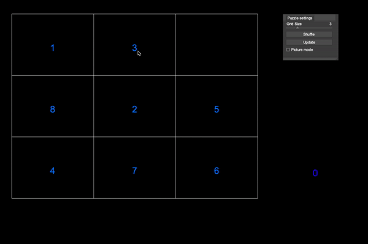

# Slide

Read [this document](https://cliutils.gitlab.io/modern-cmake/chapters/basics/structure.html) to understand the project
layout.

**Author**: Venyatha - [`vmanne3@illinois.edu`](mailto:vmanne3@illinois.edu)

**Demo**:
- 
- 
- A classic 3 x 3 puzzle 

**Build**:
- 
- [CMake](https://cmake.org/)
- [Cinder](https://libcinder.org/)
- [Catch-2](https://github.com/catchorg/Catch2)
- [PretzelGui](https://github.com/cwhitney/PretzelGui)
    - click [here](https://courses.grainger.illinois.edu/cs126/sp2020/notes/cmake/) for set up instructions. Use the PretzelGui case study
- You must have [Clion](https://www.jetbrains.com/clion/download/#section=mac) to build this project    

**How to Play**:
- 
- navigate the puzzle by right-clicking on the tile you want to move. Remember that you can only move pieces that are adjacent to an empty tile!
- press 'g' to toggle visibility of the side-bar