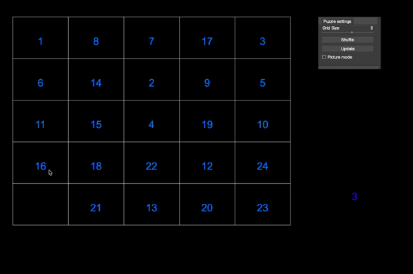

# Slide

**Author**: Venyatha - [`vmanne3@illinois.edu`](mailto:vmanne3@illinois.edu)

**Demo**:
- 
- Your classic 3 x 3 puzzle adapted to allow the image of your choosing

- Challenge yourself by trying a larger grid size:

**Build**:
- 
- [CMake](https://cmake.org/)
- [Cinder](https://libcinder.org/)
- [Catch-2](https://github.com/catchorg/Catch2)
- [PretzelGui](https://github.com/cwhitney/PretzelGui)
    - Click [here](https://courses.grainger.illinois.edu/cs126/sp2020/notes/cmake/) for set up instructions. Use the PretzelGui case study
- You must have [Clion](https://www.jetbrains.com/clion/download/#section=mac) to build this project    

**How to Play**:
- 
- Enter the absolute path of your image into the program arguments
- Navigate the puzzle by right-clicking on the tile you want to move. Remember that you can only move pieces that are adjacent to an empty tile!
- Use the slider for your preferred grid size and click update (picture mode is only availabale on a 3x3 grid)
- Click reset to try solving the puzzle again, from its original configuration
- Press 'g' to toggle visibility of the side-bar
